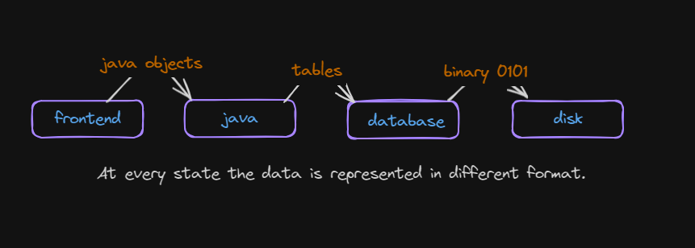
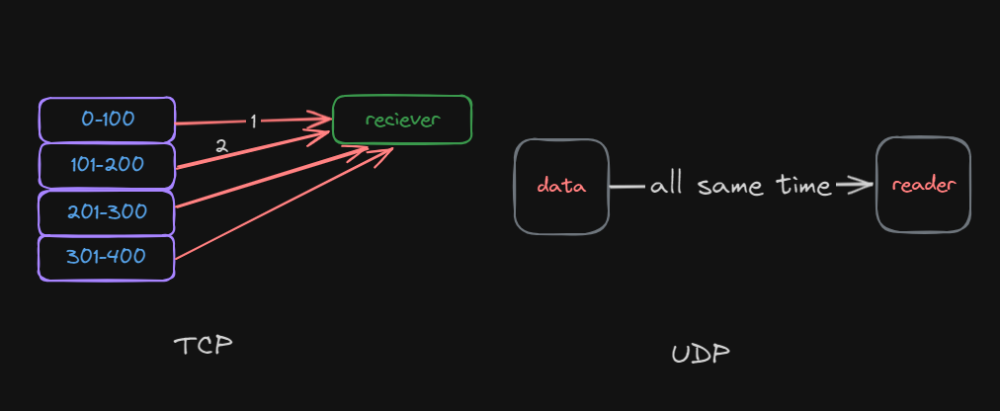

# Communication Protocols and Concepts

## 1. SOAP (Simple Object Access Protocol)

- SOAP is an `outdated protocol` but was popular during its era.
- It enabled communication between applications written in different languages (e.g., Java and Python) by converting objects to `XML files.`
- These XML files were serialized, sent over the network, and de-serialized at the receiving end.

### Challenges:

1. **XML**:
   - Supported only XML, making the system slow.
   - Most of the transferred data included metadata about XML, adding overhead.

## 2. REST (Representational State Transfer) 

- REST supports various file formats, including **JSON**, **text**, and **XML**.
- Built on top of the **HTTP protocol**.
- It is **stateless** and allows for easy scaling of applications.
- Gained popularity due to JSON support, which is lightweight and enables faster communication.

### Idempotency:

- **Idempotent Methods**:
  - Calling the API repeatedly returns the same data every time.
  - Examples: `GET`, `PUT` (Not Cacheable), `DELETE`
- **Non-Idempotent Methods**:
  - Data returned by the server changes with each request.
  - Example: `POST`

### PUT vs PATCH:

- **PUT**:
  - Requires resending the entire object to update data.
- **PATCH**:
  - Only the updated attributes need to be sent.

## 3. HTTP (Hypertext Transfer Protocol)

- HTTP is a method for encoding and transporting information between a **client** (e.g., web browser) and a **server**.
- It is the primary protocol for internet communication.
- Operates at the **application layer**, relying on lower-level protocols like **TCP** and **UDP**.

## 4. TCP (Transfer Control Protocol)

- TCP is a **connection-oriented protocol** over an IP network.
- Connections are established and terminated using a **handshake**.

### Key Features:

1. **Packet Reliability**:
   - Ensures all packets reach their destination in order and without corruption using:
     - Sequence numbers
     - Checksum fields
2. **Acknowledgment and Retransmission**:
   - Lost packets are automatically re-sent.

### Use Cases:

- Use TCP over UDP when:
  1. All data needs to arrive intact.
  2. Efficient use of network throughput is required.

## 5. UDP (User Datagram Protocol)

- UDP is a **connection-less protocol**.
- Datagrams (similar to packets):
  - May arrive out of order.
  - May not arrive at all.
- UDP **does not support congestion control**, making it more efficient in certain scenarios.

### Use Cases:

- Ideal for **video streaming applications** where:
  - Data may lag or drop but needs to keep flowing.

### When to Use UDP Over TCP:

1. When **low latency** is critical.
2. When late data is worse than lost data.
3. When custom error correction is implemented.

## 6. OSI (Open System Interconnection) Model

- OSI is a **7-layer model** used to conceptualize and standardize network communication.
- It’s a vast topic in networking and includes layers like:
  - Physical
  - Data Link
  - Network
  - Transport
  - Session
  - Presentation
  - Application
