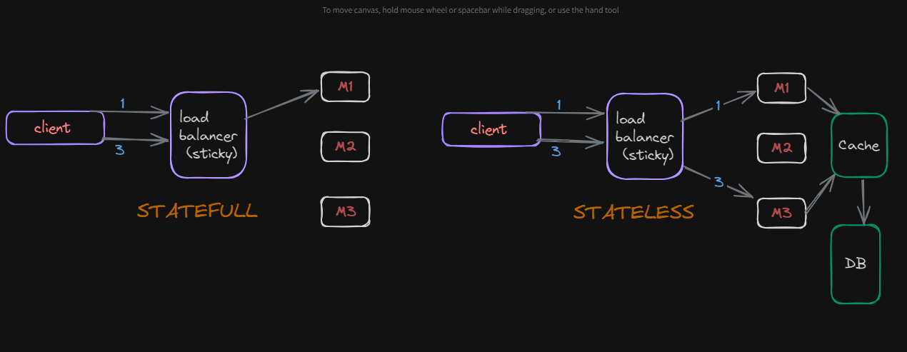

# Stateful Systems

## Practical Example 

- **Scenario**: Suppose we have developed Amazon with geographically distributed instances.
  - When a user visits, the **load balancer** assigns them to a machine where they can add items to their cart.
  - **Problem**: If the user revisits and is assigned to a different machine, their cart will appear empty. **(Big Loss)**

## Stateful Systems

- **Definition**: A system that retains information about a user across sessions or interactions.
- **Solution**: Using **sticky load balancing** ensures a user always interacts with the same machine, preserving their cart data.

### **Advantages**

1. **Customized Flow**: Allows enhanced user experience by retaining session data.

### **Challenges**

1. **Failure Recovery**: Expensive and slow to recover lost state information.
2. **Scaling**: Becomes more complex as state data needs synchronization across nodes.

### **Analogy**

- A **security guard** with a high memory recognizes society cars.
- If replaced, the new guard needs time and resources to rebuild this knowledge.

## Stateless Systems

- **Definition**: A system that does not retain user information between requests.
- **Solution**: Use persistent storage (e.g., databases) and caching to store state information outside the application.

### **Advantages**

1. **Scalability**: Easily scales horizontally as no state synchronization is required.
2. **Fast Recovery**: Quick recovery from failures since no state data is lost.
